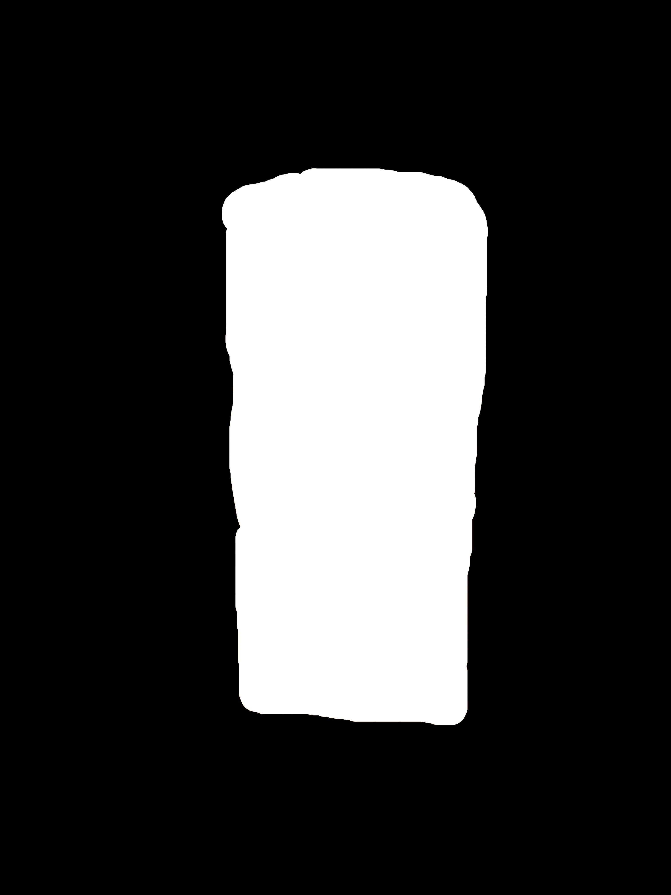

# huggingface-diffusion-library-testing
Using huggingface public diffusion library to generate images on the springfield cluster. 

## How to generate images from text on the cluster

First we have to transfer all necesarry files to the cluster storage space. This can be done with:

```

sh sync_to_cluster.sh

```

This will create a folder in the root directory of the cluster storage space called *diffusion_lib_test*

# **text2img**

In order to generate image from text promt with the cluster:

```

frink run inpainting.yaml -f 

```

For changing the image promt one can just change the variable *promt_list* in text2img.py.
Below is an example promt list: 

```python

prompt_list = ['a home for all the critters of the forest, big tree, tall , lush , calm , book cover , ultra realistic , 4k , 8k'] * num_of_imgs


```

# **Inpainting**

In order to use inpainting we have to place an image and a mask image into the folder cluster_dir/inpainting_imgs_test
Here is an example of such images: 




```

frink run inpainting.yaml -f 

```

In the file inpainting.py one can change the variable *prompt_list* in order to change the prompt

