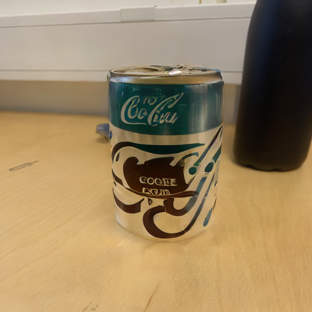

# huggingface-diffusion-library-testing
Using huggingface public diffusion library to generate images on the springfield cluster. 

## How to generate images from text prompts, using the cluster

First we have to transfer all necesarry files to the cluster storage space. This can be done with:

```

sh sync_to_cluster.sh

```

This will create a folder and transfer necessary files in the root directory of the cluster storage space called *diffusion_lib_test*.  

### **text2img**
Example image of what has been created with the prompt *'a home for all the critters of the forest, big tree, tall, lush, calm, book cover, ultra realistic, 4k, 8k'*


In order to generate image from text promt with the cluster:

```

frink run inpainting.yaml -f 

```

Many variables can be changed when generating images: 

* -p: Image prompt
* -n: Number of images to be generated
* -gs: Guidance scale
* -H: Height
* -W: Width 
* -n-inf-steps: Number of inference steps

They can all be changed by changing whats in the *text2img.sh* file.

```shell

python3 text2img.py \
-p 'a home for all the critters of the forest, big tree, tall, lush, calm, book cover, ultra realistic, 4k, 8k' \
-n 5 -gs 7.5 -H 512 -W 512 -n-inf-s 80


```

After each change of files contained in the *cluster_dir* directory, the command

```shell

sh sync_to_cluster.sh

```

has to be run again in order to sync the change with the cluster storage. 

### **Inpainting**

In order to use inpainting we have to place an image to inpaint and a mask image into the folder cluster_dir/inpainting_imgs_test
Here is an example of such images (The order: original image, mask image, generated image): 


<p float="left">
  
  
  
</p>


In the file inpainting.py one can change the variable *prompt_list* in order to change the prompt.

### Changing the parameters

in the *.sh* files where there are parameters one can easily. 

* **num_inference_steps:** The reference number of denoising steps. More denoising steps usually lead to a higher quality image at
                the expense of slower inference. This parameter will be modulated by `strength`, as explained above.
* **strength:** Conceptually, indicates how much to inpaint the masked area. Must be between 0 and 1. When `strength`
                is 1, the denoising process will be run on the masked area for the full number of iterations specified
                in `num_inference_steps`. `init_image` will be used as a reference for the masked area, adding more
                noise to that region the larger the `strength`. If `strength` is 0, no inpainting will occur.
* **guidance_scale:** Guidance scale is enabled by setting `guidance_scale >
                1`. Higher guidance scale encourages to generate images that are closely linked to the text `prompt`,
                usually at the expense of lower image quality.

```shell

python3 inpainting.py \
-p 'cola can, red, standing on wooden table, 4k, 8k' \
-n 10 -gs 20 -s 0.5 -n-inf-s 500

```

For starting generating in the masked area use the command: 

```

frink run inpainting.yaml -f 

```

WHen the cluster is done generating we have to resync back with the command: 

```shell

sh sync_from_cluster.sh

```

The newly generated images will be placed in the folder *cluster_dir/imgs/* and have a file name 
which includes the prompt and all the parameters used and a uniqe image id randomly generated at the end.


